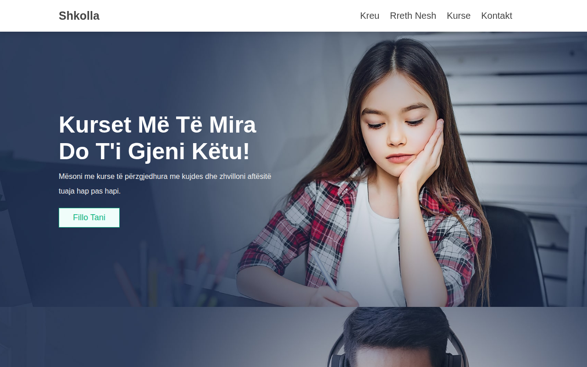

# School-Website

Created by **Erion Nezha**

Faqe interneti për shkollë — kreu, kurse, rreth nesh dhe kontakt — e përshtatur plotësisht në gjuhën shqipe.

**Demo live:** https://erionnezha.github.io/School-Website/



## Përshkrimi

Faqe moderne dhe responsive për një shkollë, me katër faqe:

- **Kreu** (`index.html`) — slider kryesor, lëndët më të kërkuara, kurset e veçanta
- **Kurse** (`courses.html`) — lista e kurseve me module dhe orë, me butonin "shfaq më shumë"
- **Rreth Nesh** (`about.html`) — prezantimi i shkollës
- **Kontakt** (`contact.html`) — të dhënat e kontaktit, formulari i mesazhit dhe pyetjet më të shpeshta

Teksti origjinal i shabllonit (anglisht + "Lorem ipsum") është përkthyer dhe përshtatur në shqip; emrat, kontaktet dhe statistikat false të shabllonit janë hequr.

## Si hapet lokalisht

Nuk ka nevojë për server apo build — thjesht hap `index.html` në shfletues:

```bash
git clone https://github.com/ErionNezha/School-Website.git
cd School-Website
# hap index.html në shfletues
```

## Teknologjitë

- HTML5
- CSS3 (custom, `css/style.css`)
- JavaScript (vanilla, `js/script.js`)
- [Swiper](https://swiperjs.com/) 7 — slider-at
- [Font Awesome](https://fontawesome.com/) 5 — ikonat

## Kontakti

- Telefoni: +355 6XX XXX XXX
- Email: shembull@example.com
- Adresa: Tiranë, Shqipëri

## Licenca

© 2026 Erion Nezha. All rights reserved — shih [LICENSE](LICENSE).

---

# School-Website

Created by **Erion Nezha**

School website — home, courses, about and contact pages — fully localized in Albanian.

**Live demo:** https://erionnezha.github.io/School-Website/


## Description

Modern, responsive website for a school with four pages:

- **Home** (`index.html`) — hero slider, popular subjects, featured courses
- **Courses** (`courses.html`) — course list with modules and hours, "load more" button
- **About** (`about.html`) — school presentation
- **Contact** (`contact.html`) — contact details, message form and FAQ

The original template text (English + "Lorem ipsum") was translated and adapted into Albanian; the template's placeholder names, contacts and fake statistics were removed.

## Run locally

No server or build needed — just open `index.html` in a browser:

```bash
git clone https://github.com/ErionNezha/School-Website.git
cd School-Website
# open index.html in your browser
```

## Tech stack

- HTML5
- CSS3 (custom, `css/style.css`)
- JavaScript (vanilla, `js/script.js`)
- [Swiper](https://swiperjs.com/) 7 — sliders
- [Font Awesome](https://fontawesome.com/) 5 — icons

## Contact

- Phone: +355 6XX XXX XXX
- Email: shembull@example.com
- Address: Tirana, Albania

## License

© 2026 Erion Nezha. All rights reserved — see [LICENSE](LICENSE).
